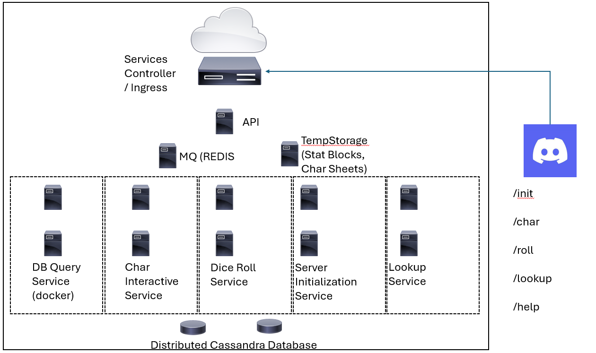

# DNDIO
A proof-of-concept application for integrating DND games with Discord.

## High-Level Service Concept

For Class CSCI 5253 (DataCenter Scale Computing), this project team seeks to develop a set of services that: 

* provides a repository of information for building DND characters

* stores character information and state in a cloud-native database

* Enables players and dungeon masters to interface with character state via Discord:

    * Discord Server Initialization for a DND campaign

    * Getting and setting character attributes

    * Requesting Dice Roll services

    * Looking up important game information

Within Discord, we will build a bot similar to [Dice Maiden](https://discord.com/application-directory/572301609305112596), but with additional features and commands that simplify the rolling of dice, integrating character information to do so and save players' time during campaigns.

## High-Level Service Architecture

To develop and deliver this service, the project team plans to leverage the following technologies and systems:

* Database implementation in Cassandra (for campaign/character information, and for game information/rules)

* Message queueing and handling (e.g. Redis for message queueing from API server to worker handlers)

* Discord API/Bot Integration (receive and relay user requests to cloud REST API)

* Virtualization/Containerization (docker/k8s on GKE) for dice roll, character interface, and game information/rule lookup services

* API with protocol buffer implementation for relaying user messages and commands from Discord Servers to REST API and backend cloud services

## Scope

As a proof-of-concept project, this project will not provide or automate 100% of the features and functionality of a Dungeons and Dragons Campaign.  The ultimate goal is to simplify dice rolling for players to accelerate the ability to cast spells, perform attacks, and so forth.  As such, the following aspects are out-of-scope for this proof of concept:

* Automating rule enforcement for characters such as:
    
    * changes to class features

    * changes to character levels

    * changes to known cantrips/spells

    * changes to proficiency bonus or skill modifiers

* Integrating temporary character bonuses or handicaps imposed by other spells, feats, or other abilities

* Tracking historic character information and changes over time

## General languages/tech:

* Cassandra for DBMS

* Docker/k8s containers for cloud service virtulization and containers

    * Scaling of workers based on client demand

* Python for:
    
    * REST API devleopment

    * Worker scaling based on request volume

* Message queueing and handling in Redis:

    * character interaction queue

    * roll request queue

    * lookup request queue

    * character sheet builder queue

* Protobufs for message relaying and handling messages from Discord Bot to API server

* Others as needed

## Project Goals

* Provide a Discord channel initialization service that:

    * Creates individual chats between Discord Bot and each character for interacting with their cloud-based character

    * stores new blank characters in the cloud service

* Provide a character interface service that allows players to:

    * Roll values and assign to character stats including Charisma, Strength, Intelligence, Wisdom, Dexterity, and Constitution

    * Lookup, select, and set Key Character Information:

        * Alignment

        * Background

        * Inventory

        * Spells / Cantrips Known 

        * Weapons

        * Equipped Items

        * Hit Points & Hit Dice

    * Request die rolls for:

        * Initiative (determine turn order)

        * attack (with equipped weapon)

        * spellcasting (for known spells)

        * skillcheck (for any skill)

* The character interface service respond to requests:

    * In the individual channel for the character's user with verbose information

    * In the campaign channel with summarized actions taken

    * Provide help messages/syntax for any erroneous requests

* Successfully enqueue and dequeue requests and responses between users and cloud services

* Successfully store, read, and update character information to/from cloud services

* Write scripts in Python to submit large volumes of requests to:

    * Initialize new Discord channels and characters

    * Submit updates to character stats

    * Submit updates to character known spells

    * Request lookups of available stat blocks and equipment information

    * 
